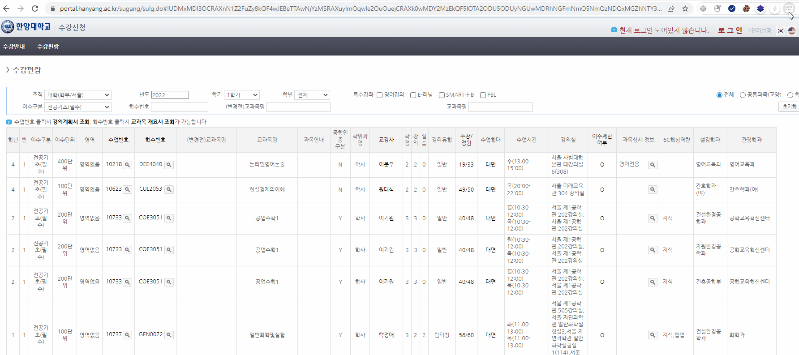

# 한양대 수강신청 확장 프로그램

> 이 확장 프로그램은 과목을 고르는 과정에서 오는 불편함을 고치기 위해 만들어졌습니다   
> 현재 성적 산출방식, 이수제한 확인 기능을 지원합니다

***이 프로그램은 수강신청 메크로가 아닙니다***

## Features

// TODO: Edit README

마우스를 올리면 해당 과목의 시간/이수대상/평가방법 등을 확인할 수 있습니다.

## How-to

// TODO: Edit README

### 사용방법

1. 수강편람 페이지를 열어주세요
2. 확장 프로그램 중 `HY 수강편람 도우미`를 눌러주세요.
3. `이 페이지에 적용`을 누른 후, 원하는 과목에 마우스를 올리면 기능을 사용하실 수 있습니다.

### 설치

> Chrome 웹 스토어 심사는 대기중입니다!   
> Whale 브라우저는 몇가지 수정할 부분이 있어서, 미뤄질 것 같습니다 ㅠㅠ

#### 직접 설치하기 (Chrome)
1. [Release](./release) 폴더에 있는 [hanyang-sugang-extension.zip](./release/chrome/hanyang-sugang-extension.zip) 파일을 다운받은 후 압축을 해체해주세요.
2. 브라우저에서  `chrome://extensions`로 들어간 후, 개발자 모드 사용을 켜주세요   
3. `압축해제된 확장 프로그램을 로드합니다`를 눌러 설치를 완료해주세요

## FAQ

사용 중 불편한 점이나 건의하고싶은 기능이 있으시면 [Issue](https://github.com/sqrti9999/hanyang-sugang-extension/issues)를 추가하거나 [오픈채팅](https://open.kakao.com/o/sTIB7M2d)으로 연락주세요!

## Contribution

// TODO: Edit README

컨트리뷰션은 언제나 환영입니다 😁   
~~코드 개판인거는... 빨리 다시 짤게요~~
