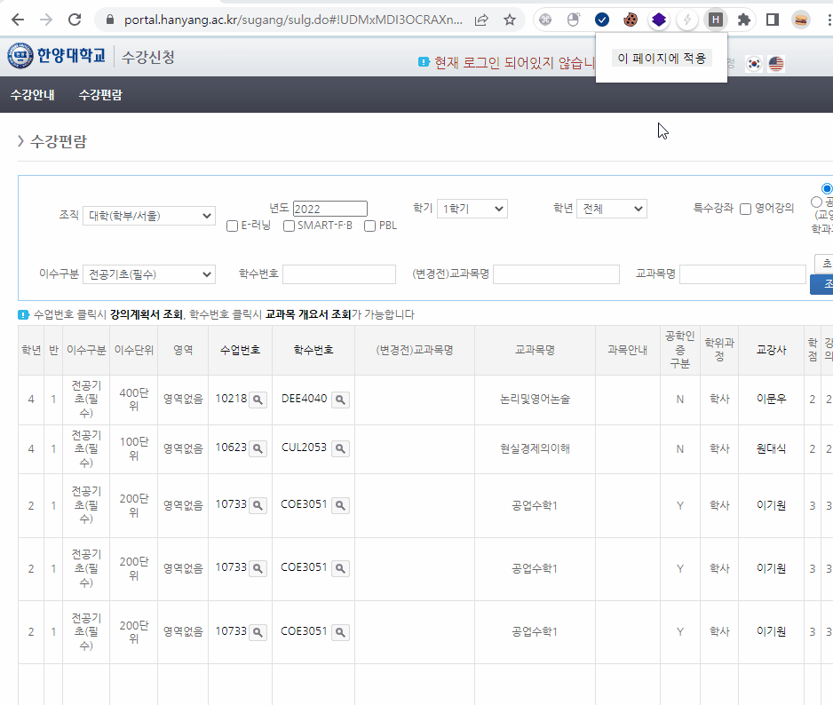

# 한양대 수강신청 확장 프로그램

> 이 확장 프로그램은 과목을 고르는 과정에서 오는 불편함을 고치기 위해 만들어졌습니다   
> 현재 성적 산출방식, 이수제한 확인 기능을 지원합니다

***이 프로그램은 수강신청 메크로가 아닙니다***

## Features

// TODO: Edit README

## How-to

// TODO: Edit README

### 설치

> Chrome 웹 스토어 심사는 대기중입니다!   
> Whale 브라우저는 몇가지 수정할 부분이 있어서, 미뤄질 것 같습니다 ㅠㅠ

#### 직접 설치하기 (Chrome)
1. [Release](./release) 폴더에 있는 [hanyang-sugang-extension.crx](hanyang-sugang-extension.crx) 파일을 다운받아주세요   
2.브라우저에서  `chrome://extensions`로 들어간 후, 개발자 모드 사용을 켜주세요   
3. 다운받은 파일을 드래그 앤 드롭으로 놓아주세요   

## Contribution

// TODO: Edit README

컨트리뷰션은 언제나 환영입니다!   
~~코드 개판인거는... 빨리 다시 짤게요~~
